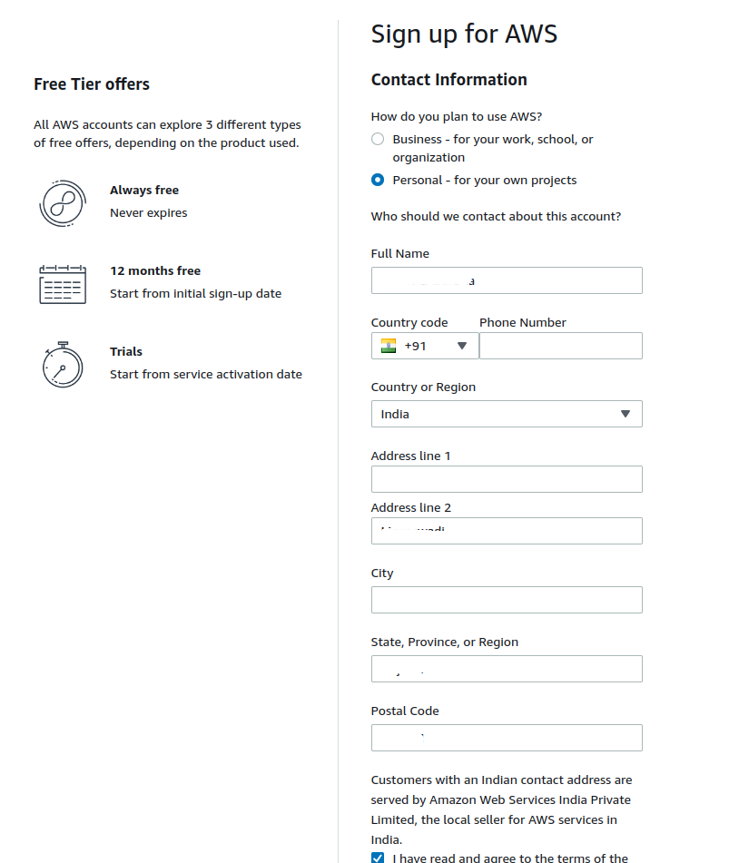

# Creating an AWS Account (India)

## Introduction

Creating an AWS account is your gateway to the cloud, enabling you to harness the full power of Amazon Web Services. This guide will walk you through the process of setting up an AWS account with an Indian billing address, highlighting key considerations to keep your account secure and compliant.

## Steps to Create an AWS Account

### 1. Enter Root User Email and Account Name
- Go to [AWS Sign-Up](https://aws.amazon.com/)
- Enter your root email and choose a unique account name.
- Verify the email address by clicking on the link sent to your inbox.

### 2. Set Root User Password
- Create a strong password for your root user.
- Confirm the password to secure your root account.

### 3. Add Personal Details
- Fill in your name, address, and phone number.
- Ensure the details match your official documents for smooth identity verification.

### 4. Add Billing Information
- Enter your billing details. AWS will charge ₹2 for confirmation, which will be refunded after a few days.
- This step is crucial to unlock full access to AWS services.

### 5. Select Account Ownership and Identity Verification
- Choose the type of account (Personal or Professional).
- Complete identity verification via a call or text message.

### 6. Confirm Identity
- AWS will verify your identity via phone call or SMS. Follow the prompts to complete the process.

### 7. Select Support Plan
- Choose the Basic Support Plan, which is free. Other plans are paid and offer additional support.

### 8. Access the AWS Management Console
- Once your account is created, log in using the root email and password.
- Navigate to the AWS Management Console.

### 9. Secure Your Root Account with MFA
- Head to IAM (Identity and Access Management) and enable Multi-Factor Authentication (MFA) for the root account.
- This adds an extra layer of security.

### 10. Create a New Admin User
- Create a new IAM user with admin permissions.
- Use this user for daily management, and avoid using the root account unless necessary.

## Disadvantages of Using Root Email to Access Management Console

- **Security Risk:** The root account has full access to all AWS resources, making it a prime target for attacks.
- **No Fine-Grained Control:** You cannot apply policies or restrictions to the root account, unlike IAM users.
- **Audit Challenges:** Activities performed with the root account are harder to audit and monitor.

### Conclusion

By following this guide, you've successfully created and secured your AWS account. Remember to use the IAM user for daily tasks and keep your root account credentials safe. You're now ready to explore and leverage AWS for your projects.